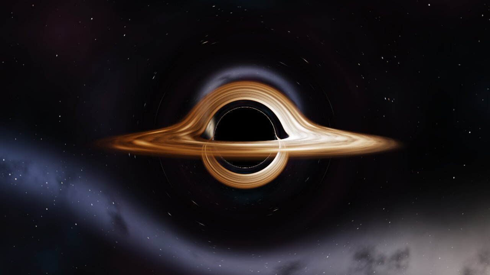
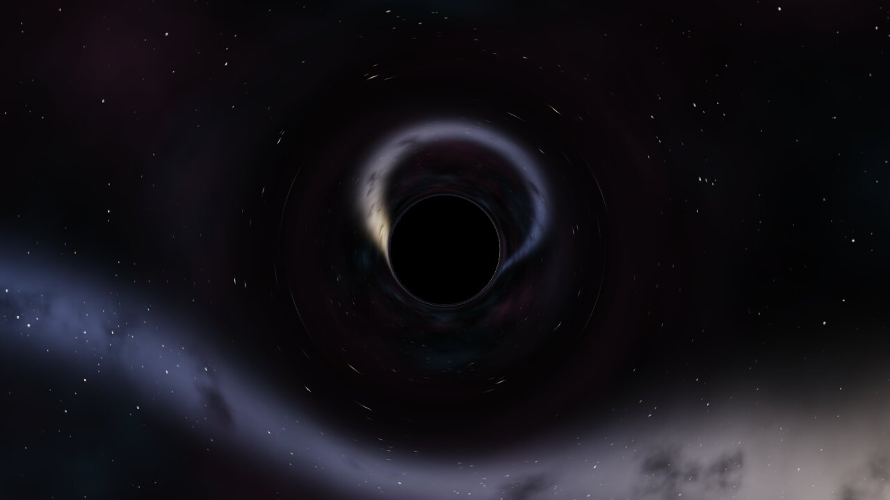
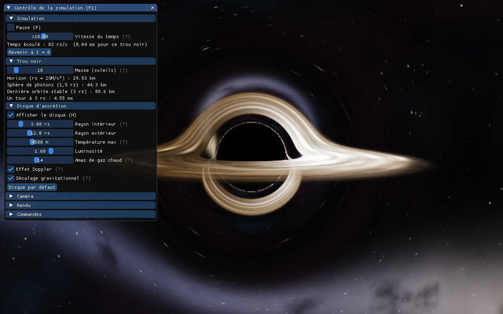
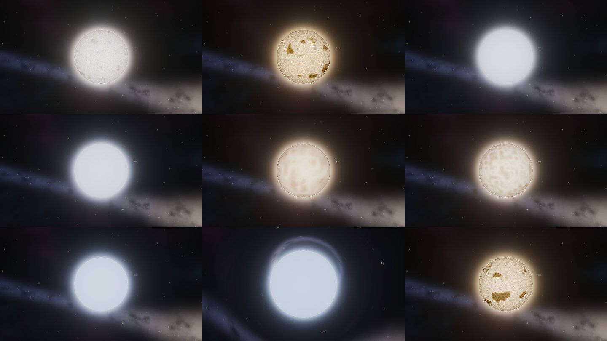
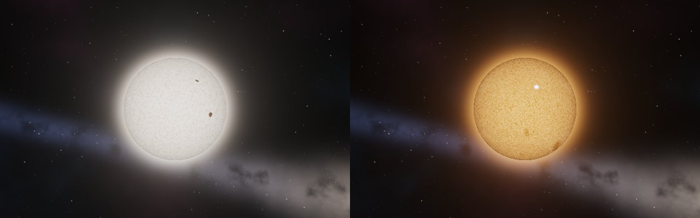
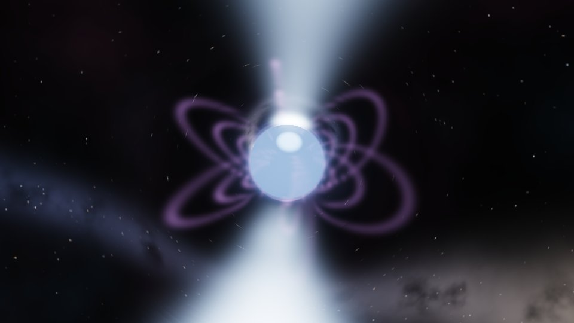
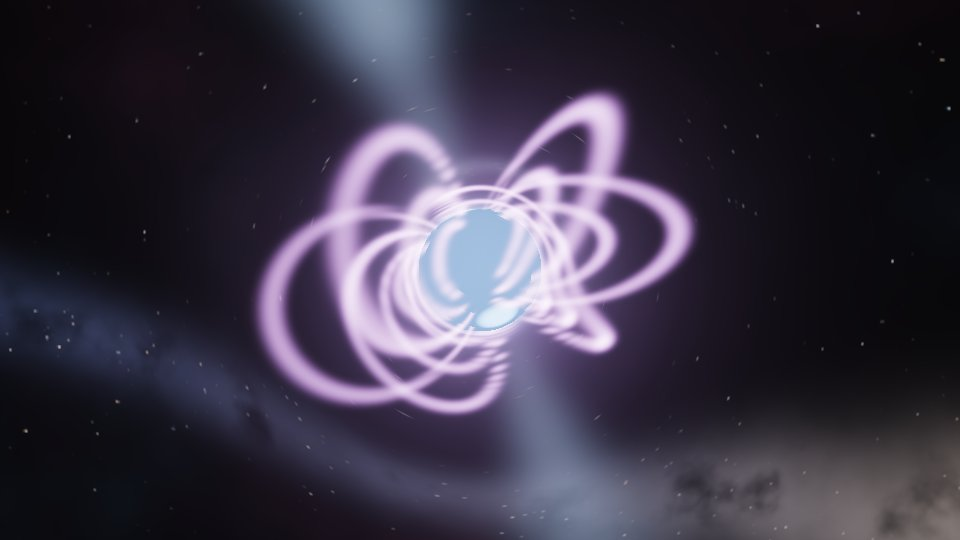
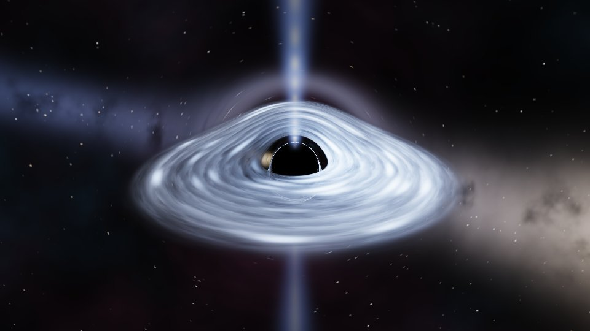
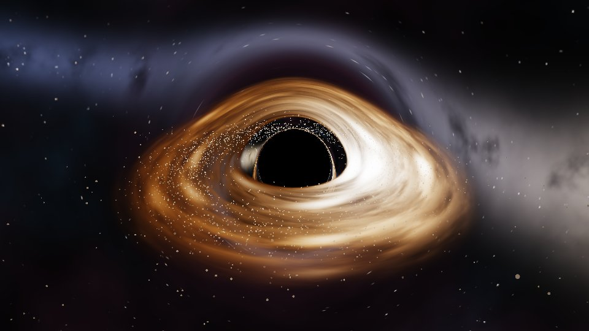
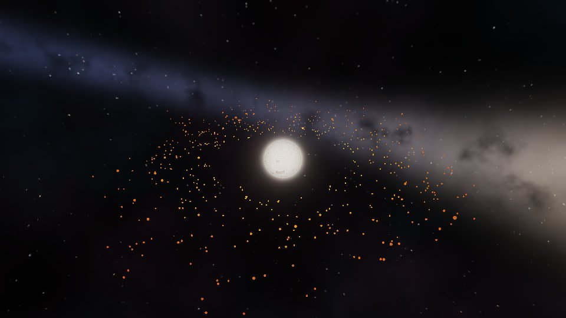

# Black Hole Test

Moteur de rendu **ray tracing** d'un trou noir, écrit en **C++ / OpenGL**,
pensé pour tourner en temps réel sur un PC modeste à carte graphique intégrée.



## L'idée

On ne simule pas les étoiles : on simule **la lumière**. Pour chaque pixel,
un rayon part de la caméra et on calcule sa trajectoire, courbée par la
gravité du trou noir (géodésiques de Schwarzschild). Selon l'endroit où il
finit, le pixel prend la couleur :

- de l'**horizon des événements** (noir) si le rayon tombe dans le trou noir ;
- du **disque d'accrétion** s'il le traverse ;
- du **fond de galaxie**, lu dans la direction *déviée* du rayon, s'il
  s'échappe. C'est ce qui produit la lentille gravitationnelle et l'anneau
  d'Einstein.

| Avec disque d'accrétion | Sans disque (lentille gravitationnelle seule) |
|---|---|
|  |  |

## Ce que fait le moteur

- Ray tracing entièrement sur la carte graphique, dans un fragment shader
  (1 pixel = 1 rayon), intégration Runge-Kutta 4.
- Ombre du trou noir à la bonne taille (≈ 2,6 rayons de Schwarzschild).
- Disque d'accrétion animé : rotation képlérienne, grumeaux chauds qui
  spiralent vers le centre, effet Doppler relativiste et décalage
  gravitationnel vers le rouge.
- On voit le dessus **et** le dessous du disque autour de l'ombre (lumière de
  l'arrière du disque courbée par le trou noir).
- Fond de galaxie procédural (étoiles, bande type Voie lactée, nébuleuses).
- Caméra libre avec inertie, orbite automatique, pause et vitesse du temps.
- Résolution de rendu réglée automatiquement pour tenir ~30 FPS.
- **Simulation d'étoiles** (touche `E`) : Soleil, Proxima du Centaure,
  Sirius A et B, Rigel, Bételgeuse, Aldébaran, étoile à neutrons, ou une
  étoile créée à partir de sa masse. Couleur de corps noir, bord assombri,
  granulation et lentille gravitationnelle pour les objets compacts.
- **Activité des étoiles** calculée à partir de la rotation et du type
  d'étoile, sans réglage à la main : taches avec ombre et pénombre, facules,
  cycle magnétique et loi de Spörer, rotation différentielle, éruptions,
  oscillations de luminosité. Les étoiles qui tournent vite sont les plus
  actives (nombre de Rossby).
  Les étoiles peu compactes sont tracées en ligne droite (la déviation y est
  inférieure à 0,1°), ce qui les rend environ 2,5 fois plus rapides.
- **Panneau de contrôle** (Dear ImGui, police Inter, `F1` ou `Tab`) : lecture
  et vitesse du temps toujours visibles, onglets Objet (trou noir, disque,
  étoiles), Vue, Rendu et Touches (toutes les touches, avec recherche), ligne d'état avec les FPS, bulle d'aide sur
  chaque réglage. Chaque touche affiche un bref message en bas de l'écran.
  Réglages de vitesse d'orbite, sensibilité de la souris, luminosité du fond,
  taille des astéroïdes, vitesse et largeur des jets, marées et fonte.







## Pulsars, magnétars, quasar et astéroïdes

| Pulsar du Crabe | Magnétar SGR 1806-20 | Quasar |
|---|---|---|
|  |  |  |

- **Étoiles à neutrons** (panneau « Étoile », ou touches `N` / `B`) : le
  type se déduit de la période de rotation P et du champ magnétique B.
  Au-dessus du champ critique quantique (4,4 × 10⁹ T) c'est un **magnétar**
  (lignes de champ tordues, sursauts) ; au-dessus de la « ligne de mort »
  des pulsars (B / P² > 1,7 × 10⁷ T/s²) c'est un **pulsar** (deux faisceaux
  qui balaient l'espace comme un phare) ; sinon elle est éteinte. Le panneau
  calcule la puissance rayonnée par le dipôle tournant et le ralentissement
  de la rotation. Modèles réels : pulsar du Crabe, pulsar milliseconde
  PSR J0437-4715, magnétar SGR 1806-20.
- **Quasar** (bouton du panneau « Trou noir », `--quasar`) : trou noir
  d'environ un milliard de soleils, disque très chaud et **jets
  relativistes** (`J`). Les jets vont à 0,8 c : l'effet Doppler amplifie
  celui qui vient vers nous et éteint presque l'autre.
- **Astéroïdes** (panneau « Astéroïdes », `G` pour un astéroïde, `F` pour un
  champ, `X` pour tout retirer) : chacun suit son orbite autour du corps
  central, et ce qui lui arrive dépend de ce corps :
  - trou noir : orbites de Paczyński-Wiita (dernière orbite stable à 3 rs),
    avalé sous l'horizon ;
  - étoile : chauffé par le rayonnement (T = T★ √(R / 2d)), il rougeoie puis
    fond au-delà de ~1 500 K, ou s'écrase sur la surface ;
  - tous : sous la **limite de Roche** il est disloqué par les marées en
    fragments qui s'étalent le long de l'orbite. Autour de Sagittarius A*
    elle est à ~10 rs, autour d'un trou noir stellaire ou d'une étoile à
    neutrons elle est immense, autour d'un quasar elle est sous l'horizon
    (l'astéroïde est avalé entier).

| Champ d'astéroïdes autour de Sagittarius A* | Champ d'astéroïdes autour du Soleil |
|---|---|
|  |  |

Limite connue : les astéroïdes ne sont pas déviés par la lentille
gravitationnelle (leur lumière va en ligne droite jusqu'à la caméra), et ils
ne s'attirent pas entre eux.

## Démarrage rapide

Outils : **VS Code**, **CMake ≥ 3.16**, **git** et un **compilateur C++17**
(sous Windows : « Build Tools for Visual Studio » ou MinGW via MSYS2).
Une carte graphique compatible **OpenGL 3.3** suffit.

1. Ouvrir la racine du dépôt dans VS Code et accepter les extensions
   recommandées (C/C++, CMake Tools, Shader languages support).
2. `Ctrl+Maj+B` pour compiler, `F5` pour lancer.

En ligne de commande :

```
cmake -S blackhole -B build
cmake --build build --config Release
./build/bin/blackhole
```

GLFW est pris sur le système s'il est installé, sinon CMake le télécharge.
Le détail par système (paquets Linux, macOS) est dans
[`blackhole/README.md`](blackhole/README.md#installer-les-outils).

## Commandes principales

| Action | Effet |
|---|---|
| clic gauche + glisser, flèches, ZQSD / WASD | tourner autour du trou noir |
| molette, Page↑ / Page↓ | zoom |
| `Espace` | orbite automatique |
| `P` / `+` / `-` | pause, accélérer, ralentir le temps |
| `T` | avancer d'un pas pendant la pause |
| `H` | afficher / cacher le disque |
| `F1` ou `Tab` | afficher / cacher le panneau de contrôle |
| `E` | passer du trou noir à une étoile, et retour |
| `N` / `B` | étoile suivante / précédente |
| `J` | jets relativistes (quasar) |
| `V` | lentille gravitationnelle (marche / arrêt) |
| `F` / `G` / `X` | champ d'astéroïdes, un astéroïde, tout retirer |
| `K` / `L` / `O` | baisser, augmenter la résolution, ou la laisser automatique |
| `Échap` | quitter |

La liste complète des touches et des options (`--fps`, `--scale`, `--bench`,
`--screenshot`…) est dans [`blackhole/README.md`](blackhole/README.md#commandes).

## Machine cible et performances

Le projet doit tourner sur un **Intel Core i5 7e génération** avec sa
**carte graphique Intel intégrée** et 16 Go de RAM. D'où ces choix :

- **OpenGL 3.3 core** (et pas 4.3 / compute shaders) pour rester compatible
  et léger ;
- fond de ciel calculé une seule fois au démarrage dans une cubemap ;
- ray tracing dans une image plus petite que la fenêtre, puis agrandie ;
- pas d'intégration proportionnel à la distance et arrêt anticipé des
  rayons capturés.

Pour mesurer sur ta machine : `./build/bin/blackhole --bench 50 --scale 0.5`.
Les détails et les mesures sont dans
[`blackhole/README.md`](blackhole/README.md#performances-carte-graphique-intégrée-intel).

## Organisation du dépôt

```
.
├── README.md                 ce fichier
├── .vscode/                  tâches de compilation, débogage, extensions
└── blackhole/
    ├── README.md             documentation technique et physique détaillée
    ├── CMakeLists.txt        build (GLFW système ou téléchargé, glad et ImGui embarqués)
    ├── assets/fonts/         police Inter du panneau (licence OFL)
    ├── docs/                 images de rendu
    ├── external/glad/        chargeur OpenGL 3.3 core (fichiers générés)
    ├── external/imgui/       Dear ImGui (panneau de contrôle)
    ├── shaders/
    │   ├── blackhole.frag    le ray tracer : géodésiques, horizon, disque
    │   ├── star.frag         ray tracer des étoiles
    │   ├── sky.frag          fond de galaxie, calculé une fois en cubemap
    │   ├── star.frag         ray tracing d'une étoile, pulsar, magnétar
    │   ├── asteroid.vert/.frag  astéroïdes dessinés en points
    │   ├── present.frag      agrandissement et tone mapping
    │   ├── noise.glsl        fonctions de bruit partagées
    │   └── fullscreen.vert   triangle plein écran
    └── src/
        ├── main.cpp          fenêtre, caméra, temps, boucle de rendu
        ├── app.hpp           état de la simulation partagé
        ├── ui.cpp/.hpp       panneau de contrôle
        ├── ui_kit.cpp/.hpp   thème et composants du panneau
        ├── ui_activity.cpp   cartes « Activité de l'étoile »
        ├── ui_compact.cpp    cartes pulsar, magnétar et quasar
        ├── ui_asteroids.cpp  cartes des astéroïdes
        ├── ui_keys.cpp       onglet Touches et messages des touches
        ├── ui_simulation.cpp carte Simulation (lentille, pause, pas à pas)
        ├── star.cpp/.hpp     modèles physiques des étoiles et étoiles à neutrons
        ├── activity.cpp/.hpp activité magnétique : taches, cycle, éruptions
        ├── asteroids.cpp/.hpp  orbites, capture, marées, fonte des astéroïdes
        └── shader.cpp/.hpp   chargement et compilation des shaders
```

La physique (équation des photons, horizon, disque, Doppler, modèle des
étoiles) est expliquée pas à pas dans [`blackhole/README.md`](blackhole/README.md#la-physique-utilisée).

## Historique

| Étape | Contenu |
|---|---|
| 1. Moteur de base | Rayons courbés (Schwarzschild, RK4), horizon, disque avec Doppler, fond procédural, config VS Code |
| 2. Caméra et animation | Caméra libre avec inertie, disque d'accrétion animé, contrôle du temps |
| 3. Optimisation Intel | Ciel en cubemap, résolution automatique, pas adaptatif, arrêt anticipé |
| 4. Build et CI | GLFW du système utilisé s'il existe, compilation automatique Linux / Windows sur GitHub |
| 5. Documentation | README racine complet, images de rendu à jour |
| 6. Étoiles et panneau | Simulation d'étoiles, panneau de contrôle Dear ImGui |
| 7. Couleurs | Couleurs de corps noir converties en lumière linéaire : étoiles froides et disque bien orangés |
| 8. Nouveau panneau | Thème moderne avec onglets et cartes, police Inter, étoiles 2,5 fois plus rapides |
| 9. Activité et objets compacts | Activité des étoiles par lois physiques ; pulsars, magnétars, quasar et astéroïdes |
| 10. Touches et réglages | Onglet Touches, lentille désactivable (`V`, 60 % d'images en plus sans lentille), pas à pas (`T`), nouveaux réglages |

## Pistes pour la suite

- Trou noir en rotation (métrique de Kerr) : ombre asymétrique.
- Anti-aliasing (plusieurs rayons par pixel) et bloom autour du disque.
- Fond de ciel à partir d'une vraie image HDR de la Voie lactée.
- Plusieurs objets dans la même scène (étoile en orbite autour du trou noir).

## Régénérer les images de ce README

```
./build/bin/blackhole --screenshot rendu.ppm --width 1280 --height 720 --time 40
./build/bin/blackhole --screenshot sans-disque.ppm --width 1280 --height 720 --no-disk
./build/bin/blackhole --star 8 --time 37 --distance 10 --screenshot pulsar.ppm
./build/bin/blackhole --star 10 --time 37 --distance 10 --screenshot magnetar.ppm
./build/bin/blackhole --quasar --time 200 --screenshot quasar.ppm
./build/bin/blackhole --bh-mass 4.3e6 --field 600 --advance 300 --pitch 0.45 --screenshot asteroides-sgr-a.ppm
./build/bin/blackhole --star 0 --field 500 --advance 20 --pitch 0.5 --distance 16 --screenshot asteroides-soleil.ppm
```

puis convertir les `.ppm` en `.jpg` (par exemple avec ImageMagick) dans
`blackhole/docs/`.
