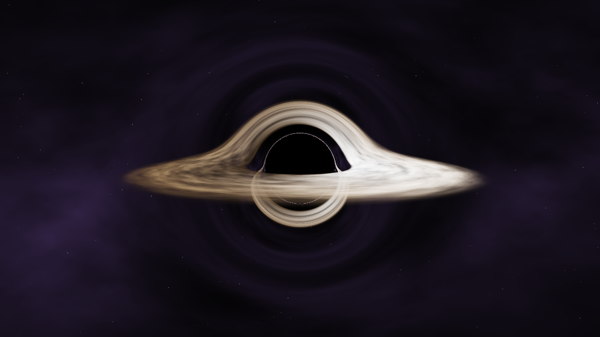

# Black Hole Test

Moteur de rendu en **C++ / OpenGL** qui simule un trou noir par *ray tracing* :
pour chaque pixel, un rayon lumineux est lancé depuis la caméra et sa
trajectoire est courbée par la gravité (métrique de Schwarzschild).



On voit :
- l'**ombre** du trou noir (les rayons qui tombent dans l'horizon) ;
- le **disque d'accrétion**, dont l'arrière apparaît *au-dessus* et *en dessous*
  du trou noir à cause de la lentille gravitationnelle ;
- l'**effet Doppler** : le côté du disque qui vient vers nous est plus lumineux ;
- les étoiles du fond, déformées autour du trou noir.

## Installer les outils

### Windows (recommandé)
1. Installer **[Visual Studio Code](https://code.visualstudio.com/)**.
2. Installer **[Visual Studio Build Tools](https://visualstudio.microsoft.com/fr/downloads/#build-tools-for-visual-studio-2022)**
   en cochant *Développement Desktop en C++* (fournit le compilateur MSVC et CMake).
3. Installer **[Git](https://git-scm.com/)**.

### Linux (Ubuntu / Debian)
```bash
sudo apt install build-essential cmake git libglfw3-dev libgl1-mesa-dev
```

### macOS
```bash
xcode-select --install
brew install cmake glfw
```

Les bibliothèques n'ont rien à télécharger à la main : **OpenGL** est fourni
par le pilote de la carte graphique, et **GLFW** (la fenêtre) est téléchargé
automatiquement par CMake s'il n'est pas déjà installé.

## Ouvrir et lancer dans VS Code

1. `Fichier > Ouvrir le dossier…` et choisir ce dépôt.
2. VS Code propose d'installer les **extensions recommandées**
   (C/C++, CMake Tools, coloration GLSL) : accepter.
3. CMake Tools demande un *kit* (compilateur) : choisir MSVC sur Windows,
   GCC ou Clang ailleurs.
4. Appuyer sur **F7** pour compiler, puis **Maj+F5** pour lancer
   (ou **F5** pour lancer avec le débogueur).

## En ligne de commande

```bash
cmake -S . -B build -DCMAKE_BUILD_TYPE=Release
cmake --build build --config Release
./build/blackhole            # Windows : build\Release\blackhole.exe
```

Rendre une seule image dans un fichier (sans interaction) :

```bash
./build/blackhole --screenshot rendu.ppm 1280 720
```

## Contrôles

| Action | Effet |
|---|---|
| Clic gauche + glisser | Tourner autour du trou noir |
| Molette | Zoomer / dézoomer |
| `R` | Recharger les shaders (modifier `blackhole.frag` sans recompiler) |
| `Échap` | Quitter |

## Organisation du code

| Fichier | Rôle |
|---|---|
| `src/main.cpp` | Fenêtre GLFW, caméra orbitale, boucle de rendu |
| `src/gl_loader.*` | Chargement des fonctions OpenGL (sans dépendance externe) |
| `src/shader.*` | Compilation des shaders GLSL |
| `shaders/fullscreen.vert` | Triangle qui couvre l'écran |
| `shaders/blackhole.frag` | **Le ray tracer** : géodésiques, disque, ciel |

## La physique en bref

Les distances sont en rayons de Schwarzschild (`rs = 1`) : horizon à `r = 1`,
sphère de photons à `r = 1.5`, bord intérieur du disque à `r = 3`
(dernière orbite stable). La trajectoire d'un photon suit

```
d²x/dt² = -1.5 · h² · x / r⁵      avec h = |x × v|
```

intégrée pas à pas (Runge-Kutta d'ordre 4) dans le fragment shader. La couleur
du disque combine un profil de température de disque mince, le décalage
Doppler relativiste et le décalage gravitationnel vers le rouge.

## Pistes pour la suite

- Trou noir en rotation (métrique de Kerr).
- Rendu progressif / accumulation pour plus de qualité.
- Bloom (halo lumineux) en post-traitement.
- Interface (ImGui) pour régler les paramètres en direct.
