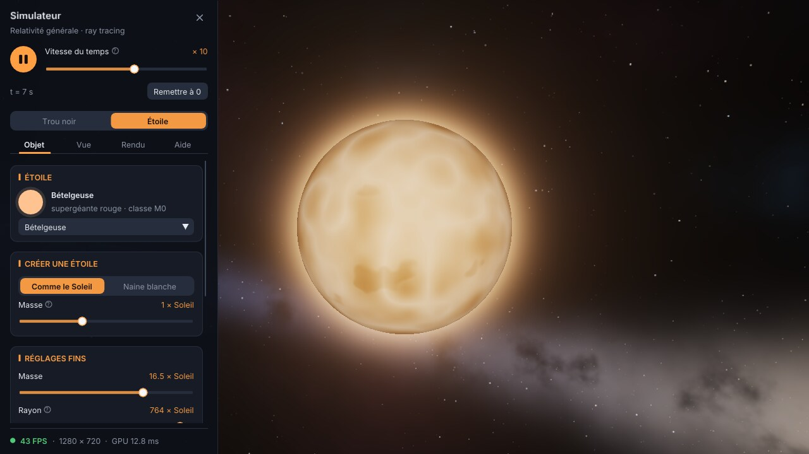

# Trou noir : moteur de rendu ray tracing (C++ / OpenGL)

On ne simule pas les étoiles : on simule la **lumière**. Pour chaque pixel, un
rayon part de la caméra et on calcule sa trajectoire courbée par la gravité du
trou noir. Selon l'endroit où il finit, le pixel prend la couleur de
l'horizon (noir), du disque d'accrétion ou du fond de galaxie.

| Avec disque d'accrétion | Sans disque (lentille gravitationnelle seule) |
|---|---|
|  |  |

## Organisation

```
blackhole/
├── CMakeLists.txt         build (télécharge GLFW automatiquement)
├── external/glad/         chargeur OpenGL 3.3 core (fichiers générés)
├── shaders/
│   ├── fullscreen.vert    triangle plein écran : 1 pixel = 1 rayon
│   ├── noise.glsl         bruit procédural partagé
│   ├── sky.frag           fond de galaxie, calculé une fois dans une cubemap
│   ├── blackhole.frag     LE ray tracer : géodésiques, disque
│   └── present.frag       agrandit l'image + tone mapping
└── src/
    ├── main.cpp           fenêtre, caméra orbitale, boucle de rendu
    ├── activity.cpp/.hpp  activité des étoiles (taches, cycle, éruptions)
    ├── ui_activity.cpp    cartes « activité » du panneau
    └── shader.cpp/.hpp    compilation des shaders
```

Tout le calcul se fait sur la carte graphique, dans `shaders/blackhole.frag`.
Le C++ ouvre la fenêtre, gère la caméra et dessine un triangle qui couvre
l'écran.

## Performances (carte graphique intégrée Intel)

Le moteur vise un PC modeste (i5 7e génération, Intel HD/UHD 620, OpenGL 3.3) :

1. **Fond de ciel précalculé.** Le fond ne dépend que de la direction : il
   est calculé une seule fois au démarrage dans une cubemap 1024×1024×6
   (`sky.frag`), au lieu de ~300 appels de bruit par pixel à chaque image.
2. **Rendu en résolution réduite, réglée automatiquement.** Le ray tracing
   se fait dans une image plus petite que la fenêtre, puis `present.frag`
   l'agrandit. Le temps GPU est mesuré à chaque image et la résolution
   s'ajuste pour tenir ~30 FPS (`--fps 60` pour viser plus).
3. **Pas d'intégration proportionnel à `r`** (~0,2 radian par pas) : ~22 pas
   par rayon en moyenne au lieu de plusieurs centaines près du trou noir, sans
   écart visible avec un rendu de référence 20 fois plus fin.
4. **Arrêt anticipé** : un rayon qui descend sous la sphère de photons
   (1,5 rs) est forcément capturé, on arrête de le suivre.

Mesuré avec le même rendu logiciel (llvmpipe) en 1280×720 : avant ~218 ms
par image, maintenant ~56 ms en pleine résolution et ~16 ms en
demi-résolution. Pour mesurer sur ta machine :

```
./build/bin/blackhole --bench 50 --scale 0.5
```

## La physique utilisée

Unités : `G = c = 1`, et le rayon de Schwarzschild `rs = 2GM/c² = 1`.

1. **Trajectoire de la lumière (géodésique nulle de Schwarzschild).**
   L'orbite d'un photon autour d'une masse vérifie l'équation de Binet :

   `d²u/dφ² + u = (3/2)·rs·u²`  avec `u = 1/r`

   Sans le terme de droite, le rayon irait tout droit. En coordonnées
   cartésiennes 3D, c'est équivalent à une accélération centrale :

   `d²x/dλ² = −(3/2)·rs·h²·x / r⁵`  où `h = |x × v|` est constant

   On l'intègre pas à pas avec **Runge-Kutta 4** (pas plus petits près du trou
   noir).

2. **Horizon des événements** : si le rayon passe sous `r = rs`, il ne
   ressortira jamais, le pixel est noir. L'ombre visible est plus grande que
   l'horizon : son rayon apparent vaut `(3√3/2)·rs ≈ 2,6 rs` (les rayons qui
   passent plus près tombent en spirale depuis la sphère de photons à
   `1,5 rs`). Le rendu retrouve bien cette taille.

3. **Disque d'accrétion** (dans le plan `y = 0`, de `3 rs` à `12 rs`).
   Le bord intérieur est l'ISCO, la dernière orbite circulaire stable
   (`6GM/c² = 3 rs`).
   - Température d'un disque mince : `T ∝ r^(−3/4)·(1 − √(r_in/r))^(1/4)`
   - Vitesse orbitale : `β = √(M / (r − 2M))`
   - Effet Doppler relativiste : `D = 1 / (γ·(1 − β·cos θ))`
     (le côté qui vient vers nous est plus brillant et plus bleu)
   - Décalage gravitationnel vers le rouge : `√(1 − rs/r)`
   - Intensité observée : `I_obs = g⁴·I_émis` avec `g = D·√(1 − rs/r)`

   On voit aussi le dessus **et** le dessous du disque au-dessus et
   au-dessous de l'ombre : c'est la lumière de l'arrière du disque, courbée
   par-dessus le trou noir.

4. **Fond de galaxie** : une fonction procédurale de la direction (étoiles,
   bande lumineuse type Voie lactée, poussière, nébuleuses). Quand un rayon
   s'échappe, on lit le fond dans sa direction **finale**, déviée : c'est ce
   qui produit l'effet de lentille gravitationnelle (images doubles, anneau
   d'Einstein).

5. **Animation du gaz.** Le temps de simulation `t` est en unités `rs/c`.
   - Le gaz tourne à la vitesse angulaire képlérienne vue depuis l'infini,
     `Ω(r) = dφ/dt = √(M/r³)` : l'intérieur tourne bien plus vite que
     l'extérieur, ce qui étire la matière en spirales.
   - Des amas de gaz chaud perdent lentement du moment cinétique et
     spiralent de ~10 rs jusqu'à l'ISCO. Leur angle est l'intégrale exacte
     de Ω : `φ(t) = φ0 + (2√M / v_r)·(1/√r(t) − 1/√r0)`. En tombant ils
     chauffent, car leur température suit `T(r)`.
   - Doppler et décalage gravitationnel s'appliquent à toute cette matière,
     donc un amas brille fort quand il arrive vers nous et s'éteint en
     repartant.

## Simuler des étoiles

La touche `E` remplace le trou noir par une étoile, rendue par le même ray
tracer (`shaders/star.frag`). Chaque étoile est définie par sa masse, son
rayon et sa température ; tout le reste est calculé par des lois physiques
dans `src/star.cpp` :


*De gauche à droite et de haut en bas : Soleil, Proxima du Centaure,
Sirius A, Rigel, Bételgeuse, Aldébaran, Sirius B (naine blanche), étoile à
neutrons, naine rouge de 0,3 M☉ (calculée à partir de sa seule masse).*

| Grandeur | Modèle |
|---|---|
| Luminosité | Stefan-Boltzmann : `L = R² (T / 5772 K)⁴` (en L☉) |
| Séquence principale | relation masse-luminosité `L ∝ M^2,3 … M^4 … M^3,5` et masse-rayon `R ∝ M^0,8` (M < 1) ou `M^0,57` ; T déduite de L et R |
| Naine blanche | relation masse-rayon de Nauenberg (électrons dégénérés) : plus lourde = plus petite |
| Couleur | corps noir à la température effective |
| Bord plus sombre | assombrissement centre-bord `I(μ) = 1 − u (1 − μ)`, u plus fort pour les étoiles froides |
| Granulation | cellules de convection, taille ∝ échelle de hauteur `T / g` : quelques cellules géantes sur Bételgeuse, d'innombrables sur une naine |
| Taches, éruptions, cycle | voir « Activité des étoiles » ci-dessous |
| Relativité | rayons courbés par la gravité avec `rs / R = 2GM / (c² R)` : invisible pour le Soleil, très net pour l'étoile à neutrons (on voit une partie de son arrière), plus le décalage gravitationnel vers le rouge |

Les distances de la caméra sont en rayons de l'étoile : toutes les étoiles
apparaissent à la même taille, le titre de la fenêtre donne leurs vraies
masse, rayon, température, luminosité et type spectral.

Pour ajouter une étoile, il suffit d'ajouter une ligne dans
`starPresets()` (`src/star.cpp`), ou d'utiliser `mainSequenceStar(masse)` /
`whiteDwarf(masse, température)`.

## Activité des étoiles

L'activité magnétique (taches, facules, cycle, éruptions) et les
oscillations sont calculées dans `src/activity.cpp` à partir de la masse,
du rayon, de la température et de la **rotation** de l'étoile, par des lois
empiriques publiées. Il n'y a plus de réglage « activité » : elle découle
de la rotation, comme pour les vraies étoiles.


*Le Soleil près du maximum de son cycle (taches aux latitudes moyennes) et
Proxima du Centaure pendant une éruption.*

| Effet | Modèle |
|---|---|
| Dynamo | seulement si l'enveloppe est convective (T < ~6 700 K, cassure de Kraft). Sirius A et Rigel n'ont ni taches ni éruptions |
| Rotation → activité | nombre de Rossby `Ro = P_rot / τ_c`, avec `log τ_c = 2,33 − 1,50 M + 0,31 M²` (Wright 2018), ~150 j pour les géantes ; `L_X / L_bol = 10^-3,13 (Ro / 0,13)^-2,7`, plafonné sous Ro = 0,13 (Wright 2011) |
| Rotation des étoiles créées | gyrochronologie à 4,6 milliards d'années, `P = 0,7725 (B−V − 0,4)^0,601 t^0,519` (Barnes 2007) : 27 j pour 1 M☉, ~95 j pour une naine M |
| Surface tachée | `f = 0,4 (L_X / L_X,sat)^0,84`, calé entre le Soleil (~0,1 %) et les naines M saturées (~40 %) |
| Taches | ombre et pénombre, `ΔT ≈ 0,6 T − 1780 K` (Berdyugina 2005), brillance `(T_tache / T)⁴` ; durée de vie de Gnevyshev-Waldmeier (~30 j) |
| Facules | aire `0,55 √f`, contraste nul au centre et ~15 % au bord |
| Cycle | période `≈ 158 P_rot` (11 ans pour le Soleil, Böhm-Vitense 2007), forme de Hathaway (1994) ; absent pour les étoiles saturées |
| Diagramme papillon | loi de Spörer `λ = 28° exp(−t / 90 mois)` (Hathaway 2011), le cycle suivant commence à haute latitude pendant que le précédent finit à l'équateur ; taches vers les pôles pour les rotateurs rapides |
| Rotation différentielle | `Ω(λ) = Ω_eq (1 − α sin² λ)`, `ΔΩ = 0,073 rad/j (T / 5772 K)^8,6` (Collier Cameron 2007) |
| Éruptions | processus de Poisson, fréquence ∝ L_X (calée sur GJ 1243), énergies `dN/dE ∝ E^-2`, profil de Davenport (2014), plasma à 9 000 K : `L_pic = E / (1,827 t½)`, `t½ ∝ E^0,39` |
| Oscillations | `ν_max = 3090 µHz (g/g☉)(T/T☉)^-½`, `Δν = 135 µHz √ρ`, `δL/L = 4,7 ppm (L/M)^0,8` (Kjeldsen & Bedding 1995) : ~100 jours et 0,5 % pour Bételgeuse |

| Étoile | Ro | Surface tachée | Cycle | Éruptions / jour |
|---|---|---|---|---|
| Soleil | 1,8 | 0,1 % | 11 ans | 0,01 |
| Proxima du Centaure | 0,6 | 1,3 % | 36 ans | 0,2 |
| Aldébaran | 3,5 | 0,02 % | 225 ans | 0,002 |
| Bételgeuse | 240 | ~0 | — | ~0 |
| Sirius A, Rigel | — | aucune (enveloppe radiative) | — | — |

Échelle de temps : 1 seconde affichée = 2 jours (vitesse x10). Les
éruptions, qui durent quelques minutes, sont montrées au ralenti ; seules
les plus grosses sont affichées quand l'étoile en produit beaucoup.

Limites connues : le cycle de Proxima mesuré est de ~7 ans (le modèle
donne 36 ans : les naines M entièrement convectives ne suivent pas la
relation des étoiles de type solaire), et les supergéantes chaudes comme
Rigel ont des pulsations propres non modélisées.

## Installer les outils

- **VS Code** avec les extensions recommandées (VS Code les propose à
  l'ouverture du dossier) : C/C++, CMake Tools, Shader languages support.
- **CMake ≥ 3.16** et **git** (GLFW est téléchargé au premier configure).
- **Un compilateur C++17** :
  - Windows : « Build Tools for Visual Studio » (charge de travail
    *Développement Desktop en C++*), puis ouvrir VS Code depuis
    « Developer PowerShell for VS ». MinGW via MSYS2 marche aussi.
  - Linux : `sudo apt install build-essential cmake git libgl1-mesa-dev
    libx11-dev libxrandr-dev libxinerama-dev libxcursor-dev libxi-dev`
  - macOS : `xcode-select --install` et `brew install cmake`.
- Une carte graphique compatible **OpenGL 3.3**.

## Compiler et lancer dans VS Code

Ouvrir la **racine du dépôt** dans VS Code, puis :

- `Ctrl+Maj+B` : configure et compile (tâche « CMake: compiler »).
- `F5` : compile puis lance sous le débogueur (choisir la configuration
  « gdb / lldb » ou « Visual Studio / MSVC » selon le compilateur).
- Ou `Terminal > Exécuter la tâche… > Lancer le trou noir`.

En ligne de commande :

```
cmake -S blackhole -B build
cmake --build build --config Release
./build/bin/blackhole
```

## Panneau de contrôle

Un panneau (Dear ImGui, police Inter) occupe le bord gauche ; `F1`, `Tab`
ou la croix le cachent, et la pastille qui reste en haut à gauche le rouvre.




De haut en bas :

- **Lecture / pause** et **vitesse du temps**, toujours visibles, avec le
  temps écoulé (en rs/c et en temps réel pour la masse choisie).
- **Scène** : trou noir ou étoile (`E`).
- **Onglet Objet** :
  - trou noir : masse en masses solaires. L'image ne change pas (tout est
    calculé en rs), mais le panneau donne les vraies grandeurs : horizon,
    sphère de photons, dernière orbite stable, durée d'un tour ;
  - disque d'accrétion : bords intérieur et extérieur, température,
    luminosité, amas chauds, et interrupteurs pour couper l'effet Doppler ou
    le décalage gravitationnel ;
  - étoile : étoile connue (Soleil, Proxima du Centaure, Sirius A et B,
    Rigel, Bételgeuse, Aldébaran, étoile à neutrons), création d'une étoile
    comme le Soleil ou d'une naine blanche à partir de sa masse, réglages
    fins, et ce que la physique en déduit (luminosité, gravité, compacité) ;
  - activité de l'étoile (`src/ui_activity.cpp`) : nombre de Rossby,
    rayons X, rotation différentielle, phase du cycle (réglable), surface
    tachée, latitude des taches, éruptions en cours, oscillations.
- **Onglet Vue** : distance, angles, champ de vision, orbite automatique.
- **Onglet Rendu** : résolution (auto ou fixe), FPS visé, pas max par rayon,
  mesures, exposition, rechargement des shaders.
- **Onglet Aide** : souris et raccourcis clavier.
- **Ligne d'état** : FPS (vert, orange ou rouge selon l'objectif),
  résolution du calcul, temps GPU.

Chaque réglage a une bulle d'aide (le petit `?`) ; `Ctrl + clic` sur un
curseur permet de taper une valeur.

Pour ajouter une section au panneau depuis un autre fichier, voir l'exemple
en tête de `src/ui_kit.hpp` (macros `UI_SECTION` et `UI_SCENE`).

Quand la souris est sur le panneau, elle ne fait pas tourner la caméra.

## Commandes

Les lettres marchent en AZERTY comme en QWERTY.

| Action | Effet |
|---|---|
| clic gauche + glisser | tourner autour du trou noir (la caméra garde de l'élan) |
| flèches, ou ZQSD (WASD en QWERTY) | tourner autour du trou noir |
| molette, ou Page↑ / Page↓ | zoom avant / arrière (jusqu'à 2,5 rs) |
| `Espace` | orbite automatique de la caméra |
| `C` | recentrer la caméra |
| `P` | pause de la simulation |
| `+` / `-` | accélérer / ralentir le temps |
| `H` | afficher / cacher le disque d'accrétion |
| `K` / `L` | baisser / augmenter la résolution du rendu (passe en mode fixe) |
| `O` | résolution automatique (activée au démarrage) |
| `R` | recharger les shaders (modifier `blackhole.frag`, sauvegarder, `R`) |
| `E` | passer du trou noir à une étoile, et retour |
| `N` / `B` | étoile suivante / précédente de la liste |
| `I` / `U` | étoile de la séquence principale plus / moins massive (×1,25) |
| `F1` ou `Tab` | afficher / cacher le panneau de contrôle |
| `Échap` | quitter |

La barre de titre affiche les FPS, la résolution du rendu, la vitesse du
temps et la distance.

Options :

| Option | Effet |
|---|---|
| `--fps N` | FPS visé par la résolution automatique (30 par défaut) |
| `--scale S` | résolution fixe, fraction de la fenêtre (0.25 à 1) |
| `--sky N` | taille d'une face du ciel (1024 ; 512 si la mémoire manque) |
| `--bench N` | rend N images hors écran et affiche le temps moyen |
| `--star N` | démarre sur l'étoile n° N (0 Soleil, 1 Proxima, 2 Sirius A, 3 Rigel, 4 Bételgeuse, 5 Aldébaran, 6 Sirius B, 7 étoile à neutrons) |
| `--mass M` | démarre sur une étoile de la séquence principale de M masses solaires |

Image fixe sans fenêtre (pleine résolution) :
`blackhole --screenshot rendu.ppm --width 1920 --height 1080 [--no-disk] [--time T] [--yaw A] [--pitch A] [--distance D]`

## Pistes pour la suite

- Trou noir en rotation (métrique de Kerr) : ombre asymétrique.
- Rendu progressif / anti-aliasing (plusieurs rayons par pixel).
- Fond de ciel à partir d'une vraie image HDR de la Voie lactée (il suffit
  de remplir la cubemap avec l'image au lieu de `sky.frag`).
- Bloom autour du disque.
